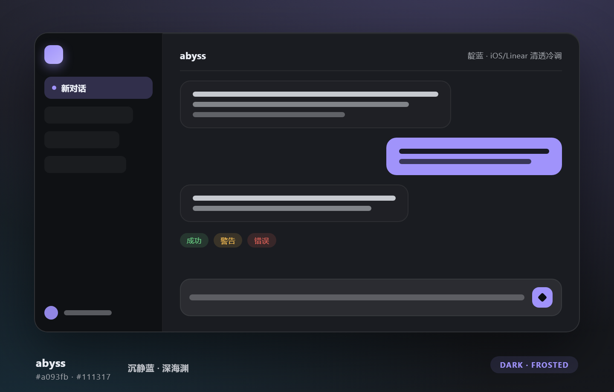
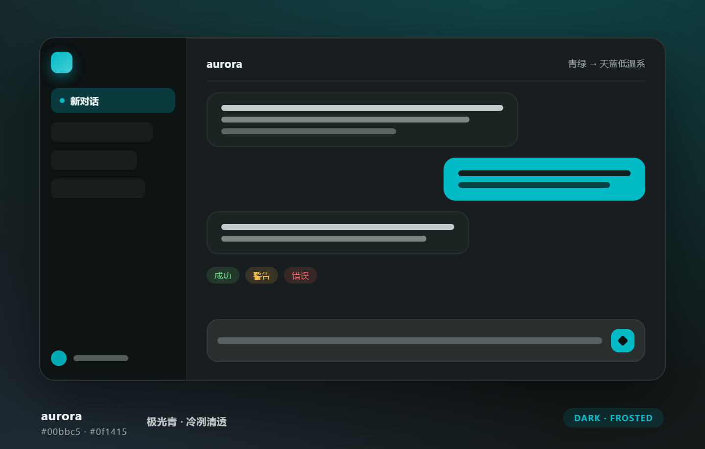
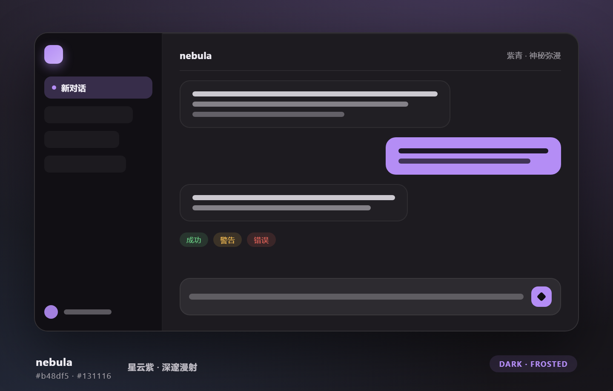
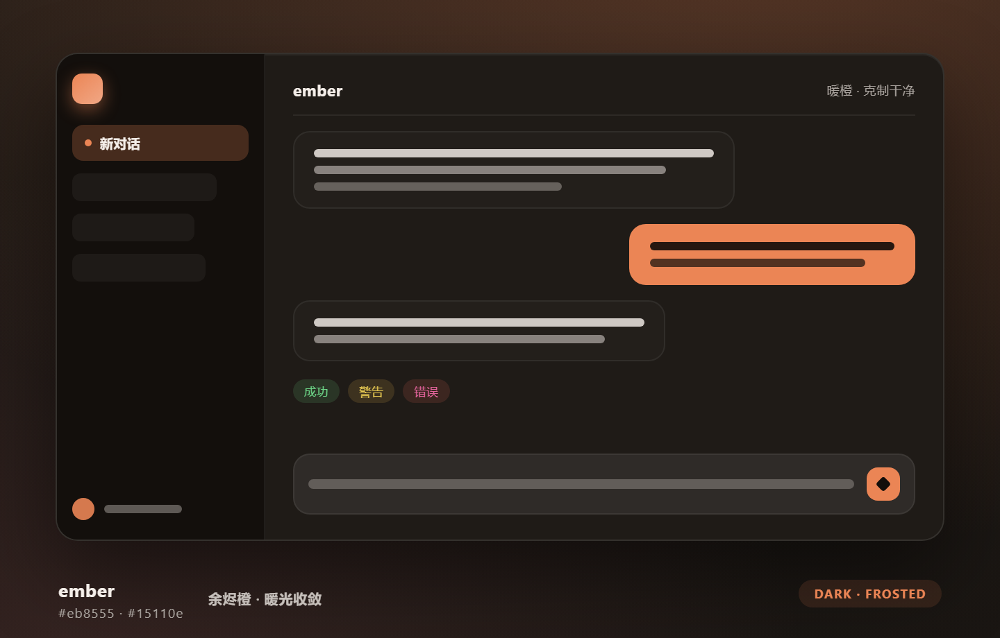
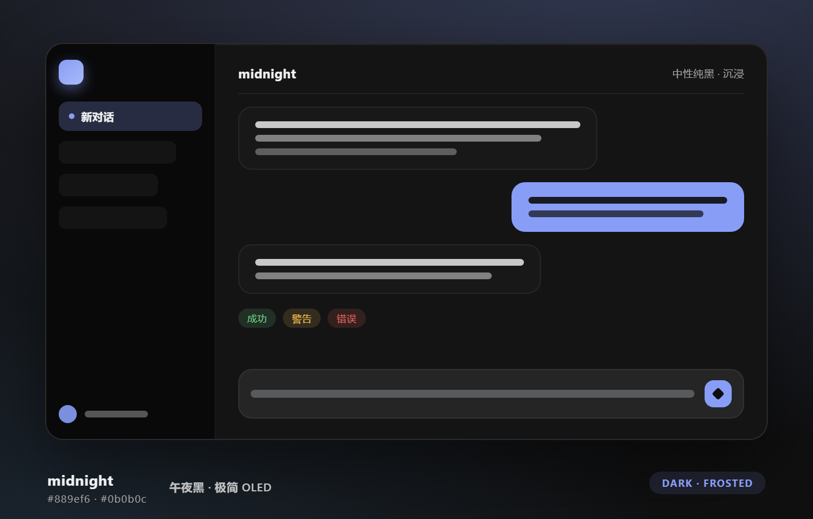
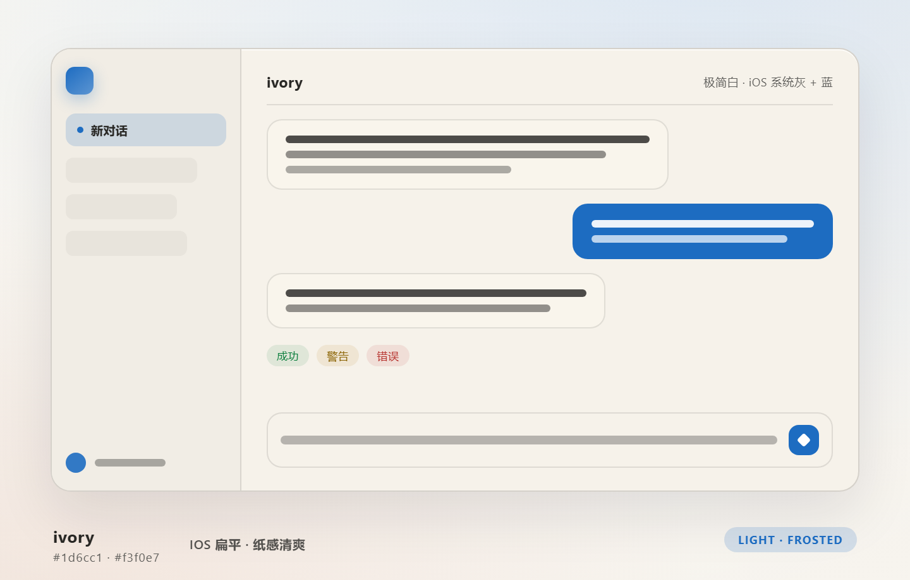
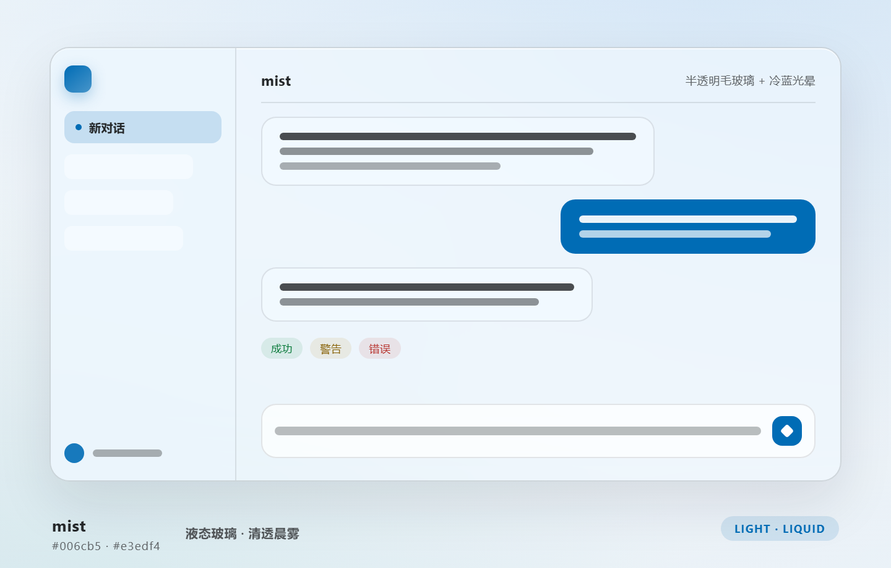
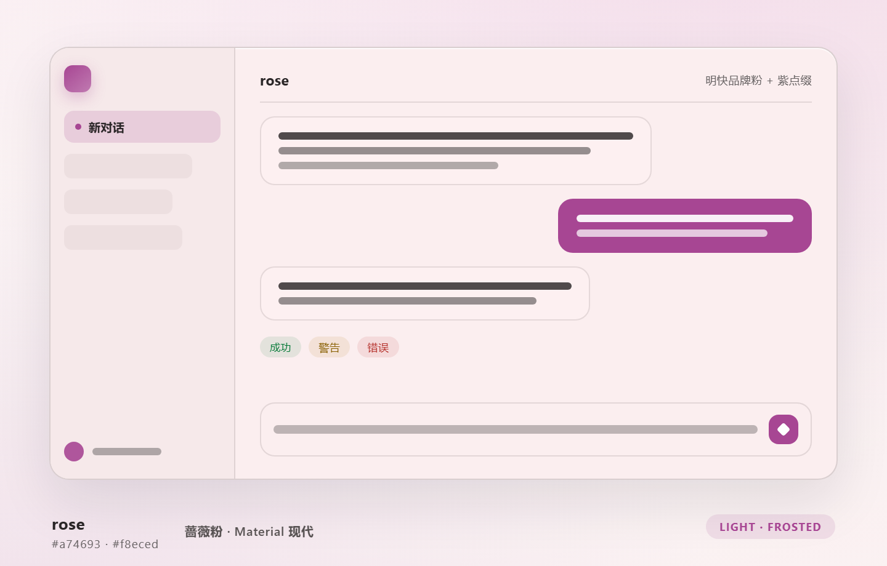

<p align="center">
  <strong>中文</strong> · <a href="./docs/i18n/README.en.md">English</a> · <a href="./docs/i18n/README.ja.md">日本語</a> · <a href="./docs/i18n/README.ko.md">한국어</a> · <a href="./docs/i18n/README.es.md">Español</a> · <a href="./docs/i18n/README.fr.md">Français</a> · <a href="./docs/i18n/README.de.md">Deutsch</a> · <a href="./docs/i18n/README.ru.md">Русский</a>
</p>

<div align="center">

# dsh-dream-skin 🔮
[](https://dsh-insights.com/p/RevolutionLA/dsh-dream-skin/)

**为 DeepSeek Harness 换上一张克制、清透、有质感的「脸」。**

原生换肤 · 背景壁纸 · 强调色 · 主题包 —— 一条 `--dsw-*` token 生态内的优雅实现。装一次，用很久。

> **写代码的地方，可以很安静。**

| 🎨 8 套原创主题 | 🖼️ 壁纸 + 弥散光 | 🎯 克制的强调色 | 📦 主题包可分享 |
|---|---|---|---|

> 1 行安装 · 纯原生（无注入/不改安装包）· 不因 DSH 更新失效

</div>

---

## 🎮 两种玩法，一条插件都给你

<table>
  <tr>
    <td align="center" width="50%"><h3>🪄 玩法一：开箱即用的优雅</h3></td>
    <td align="center" width="50%"><h3>🧱 玩法二：随你掌控的 DIY</h3></td>
  </tr>
  <tr>
    <td>内置 <b>8 套设计师调校的预设皮肤</b>（Mirage 幻梦系列），浅色 / 深色兼顾，每套自带专属弥散光背景。<br/><b>戴上即高级，不用任何调参。</b></td>
    <td>在预设之上，你还能 <b>换壁纸（本地图 / URL / 渐变）</b>、<b>叠加强调色 Accent</b>、<b>拖入或分享一个主题包</b>，内部每个 token 都能摸到。<br/><b>想要的样子，自己捏。</b></td>
  </tr>
</table>

两种玩法分层独立、互不干扰：预设皮肤决定「材质与底色」，DIY 一层是纯叠加（`overrideTokens`），随开随关、一键还原。

---

## 📸 实机截图

> 真机效果，非概念图。左：应用皮肤后的 DSH 界面；右：设置里的「外观 / Theme」分节。

<p align="center">
  
  &nbsp;&nbsp;
  
</p>

---

## 🎨 玩法一：8 套预设皮肤（Mirage 幻梦系列）

> **开箱即用的优雅。** 在 **设置 → 外观（Theme）** 一键切换。下列预览由各皮肤的**真实 token + 专属弥散光背景**生成——所见即所得，点开可放大查看精致材质。

<table>
  <tr>
    <td align="center"><a href="docs/previews/abyss.png"></a><br/><b>abyss</b> · 🕶️ 沉静蓝<br/><sub>冷静深沉的靛蓝，克制不喧哗</sub></td>
    <td align="center"><a href="docs/previews/aurora.png"></a><br/><b>aurora</b> · 🌌 极光青<br/><sub>清冽通透的冷青，自然冷调</sub></td>
    <td align="center"><a href="docs/previews/nebula.png"></a><br/><b>nebula</b> · 🪐 星云紫<br/><sub>深邃漫射的紫青，朦胧神秘</sub></td>
    <td align="center"><a href="docs/previews/ember.png"></a><br/><b>ember</b> · 🔥 余烬橙<br/><sub>温暖克制的琥珀橙</sub></td>
  </tr>
  <tr>
    <td align="center"><a href="docs/previews/midnight.png"></a><br/><b>midnight</b> · 🌚 午夜黑<br/><sub>极简纯黑，OLED 沉浸</sub></td>
    <td align="center"><a href="docs/previews/ivory.png"></a><br/><b>ivory</b> · 📐 iOS 扁平<br/><sub>极简平白，iOS 系统灰 + 克制的蓝</sub></td>
    <td align="center"><a href="docs/previews/mist.png"></a><br/><b>mist</b> · 🧊 干净明亮<br/><sub>清透明亮的玻璃质感，半透明 + 模糊</sub></td>
    <td align="center"><a href="docs/previews/rose.png"></a><br/><b>rose</b> · 🌸 Material 粉<br/><sub>明快彩粉，谷歌 Material 扁平彩色</sub></td>
  </tr>
</table>

> 浅色 / 深色兼顾：`mist`、`ivory`、`rose` 为浅色系，其余为深色系。不喜欢预设？往下看**玩法二**。

---

## 🧱 强大 DIY 空间（玩法二）

> 预设皮肤之外，dsh-dream-skin 还给你一套完整的自定义体系——想捏出独一无二的工作区，从这里开始。

| 能力 | 玩法二 · 你能做什么 |
|------|------|
| 🖼️ **自定义壁纸 2.0** | 本地图 / **图片 URL** / **渐变预设**；附带**透明度 / 模糊 / 填充方式**（裁剪填满 · 完整显示 · 模糊填充），每套皮肤还**自动建议**一张渐变，可**自动弱化**（聚焦任务时降低干扰） |
| 🌈 **每用户强调色 Accent** | 为当前皮肤叠加自定义品牌强调色（`overrideTokens` 层，不动皮肤本身），**12 个典型色块一键选色** + 选色盘 + 随机 + 恢复主题色 |
| 📦 **主题包导入 / 导出 / 分享** | 一个 `*.dsh-theme.json` = manifest + 全套 tokens，可**导入文件**、**一键应用**、**复制分享链接**（编码进 URL hash） |
| 🪟 **弹窗不透明度** | 滑块控制下拉菜单 / 浮层 / 弹窗的底填充透明度，跟随持久化保存 |
| 🧩 **本地主题包库** | 导入的主题包集中展示，**应用 / 收藏 / 移除** 一键完成 |
| 🎲 **换一个试试（surprise me）** | 随机换一个和你当前不同的主题；**收藏**喜欢的皮肤快速切换 |
| ✅ **校验 + 回滚** | 导入时校验格式 / 必填 token / 颜色合法性；失败或移除时安全回退，不做破坏性更改 |

> 一切都叠加在预设之上，**随开随关、一键还原**到 DSH 内置外观——大胆去试，不会弄坏什么。

---

## ⚡ 一句话安装

**复制下面这句话给你的 DSH，它自己会装好一切：**

> 请帮我安装 dsh-dream-skin 换肤插件（https://github.com/RevolutionLA/dsh-dream-skin 或 npm 的 dsh-dream-skin），装完告诉我如何重启 DSH Web。

不想麻烦 Agent？命令行一条：

```sh
dsh plugin --profile web add dsh-dream-skin && dsh web
```

> 🚀 **现已发布到 npm！** 装好 DSH 后，一条命令即可安装，无需 clone。

> **致敬 [Codex-Dream-Skin](https://github.com/Fei-Away/Codex-Dream-Skin)。** 但实现路径不同：Codex 是往桌面客户端渲染进程
> 注入 CSS（CDP），而 DSH 本身是 **token 驱动的 Web GUI**，官方就提供了「第三方插件注册主题」的能力——所以本插件是
> **纯原生接入**，无注入、不改二进制、不因客户端更新失效。
>
> **不是官方产品。** 仅供美化你的 DeepSeek Harness 工作区。

---

## 🏆 为什么值得用（vs 同类 DSH 主题插件）

> 换个赛道看：同类插件要么是把一套现成色板移植过来（好看，但配置只有一个开关）、要么是锁死单一美学的定制款、
> 要么专注把外部壁纸搬进来。我们把换肤做成**一整套可调的材质与配色系统**——追求的不是「更花」，
> 而是「更准、更克制、更耐看」，像一块反复推敲的玻璃。**审美 + 可调性是我们的护城河。**

| 能力 | 本插件 | [dsh-catppuccin-theme](https://github.com/)（色板移植） | [dsh-theme-mineradio](https://github.com/)（单一美学定制） | [dsh-wallpaper-engine](https://github.com/)（壁纸桥接） |
|------|:---:|:---:|:---:|:---:|
| **8 套原创设计**（非现成色板移植，原创 token + 弥散光） | ✅ | ❌ (4 套 Catppuccin 官方色板) | ❌ (1 套香槟金美学) | ❌ |
| **毛玻璃 / 液态玻璃双材质**一键切换 | ✅ | 部分（固定玻璃质感） | ❌ | ❌ |
| **输入框 / 弹窗独立透明度滑杆** | ✅ | ❌ | ❌ | ❌ |
| **开箱即用的出厂配置**（装完重启就是调好的样子） | ✅ | ❌ | ✅（本身即成品） | ❌ |
| 自定义壁纸 + 透明度/模糊 | ✅ | ❌ | ❌ | ✅（核心能力） |
| **壁纸 2.0**（URL / 渐变预设 / 每皮肤建议 / 自动弱化 / 必应每日 + 定时更新） | ✅ | ❌ | ❌ | 部分（依赖 WE 壁纸） |
| **每用户强调色 Accent**（叠加层，不动皮肤本身） | ✅ | ❌ | ❌ | ❌ |
| **主题包导入/导出 + 分享链接**（JSON，无代码分发） | ✅ | ❌ | ❌ | ❌ |
| 本地主题包库 + 收藏 + 随机换 | ✅ | ❌ | ❌ | ❌ |
| **两代宿主兼容 + 运行时能力探测**（宿主换代自动降级不报错） | ✅ | 未知 | 未知 | ❌（需先升级内核） |
| 校验 + 回滚（不做破坏性更改） | ✅ | 部分 | — | 部分 |

> **一句话**：想要 Catppuccin 的品牌色、mineradio 的氛围感？本插件的主题包系统都能做出来或叠出来——
> 反过来不成立。

---

## ✨ 功能一览

| 能力 | 说明 |
|------|------|
| 🎨 **8 套主题预设（Mirage 幻梦）** | 在 **设置 → 外观（Theme）** 一键切换，浅色 / 深色兼顾 |
| 🖼️ **自定义壁纸** | 上传本地图（自动压缩 ≤2MB），调节**透明度 / 模糊 / 填充方式**（裁剪填满 / 完整显示 / 模糊填充） |
| 🧊 **玻璃材质（毛玻璃 / 液态玻璃）** | 一键切换玻璃质感，透明度滑杆**越右越透**；模糊一个旋钮同时驱动壁纸与玻璃表面 |
| 🖼️ **开箱即用的出厂配置** | 首次安装即带完整美化配置：星云皮肤 + 内置壁纸 + 调好的玻璃数值，装完重启就能用 |
| 🌤️ **必应每日壁纸（预置）** | 高级壁纸预填必应每日一图接口，点「应用链接」即可（重复点会**强制重新拉图**，不会被浏览器缓存挡回旧图）；也支持任意图片 URL + 定时自动更新 |
| 🔤 **内层不透明** | 卡片、输入框、消息气泡不被壁纸盖住，可读性优先 |
| ↩️ **默认还原** | 一键回到 DSH 内置外观（跟随系统） |
| 💾 **三层持久化** | 皮肤与壁纸存 `localStorage` **+ 宿主侧 `dream-skin.json`**，刷新不丢；**桌面版每次换端口、重启也不丢** |

---

## 🧩 它是什么形式的插件

**它是 DeepSeek Harness 的标准「双面插件」（`dsh-plugin`）——加载和用法与官方 `ui-theme` 完全一致。**

DeepSeek Harness 的口号是「一切皆插件」：模型、工具、沙箱、会话、UI，乃至 Agent Loop 本身都是插件。
`dsh-dream-skin` 的本质就是把「换肤」做成一个和官方 UI 包**同构**的 npm 包：

```text
            ┌────────────── dsh-dream-skin（标准 dsh-plugin / 双面插件）──────────────┐
            │  dsh.bundle   → cordis.patch.yml 插入 dream-skin 入口   (host 半边)     │
            │  dsh.client   → lib/client.js（浏览器 bundle）          (浏览器半边)     │
            └─────────────────────────────────────────────────────────────────────────┘
```

- **安装命令 = 官方唯一安装命令**：`dsh plugin --profile web add dsh-dream-skin`
- **调用的是官方扩展点**：`ctx.theme`（注册主题）、`ctx.theme.overrideTokens`（叠加层）、
  `ctx.slots`（把 UI 挂进独立的 **设置 → 外观 / Theme** 分节）。
- **manifest 契约与官方一致**：`dsh.bundle` + `dsh.client` + `exports["./client"]`。

也就是说：**你装的不是一个旁门左道的脚本，而是 DSH 官方插件体系里的标准皮肤插件。**

---

## ⚡ 快速开始（3 步）

```sh
# 1. 安装
dsh plugin --profile web add dsh-dream-skin
# 2. 重启
dsh web
# 3. 打开 设置 → 外观（Theme）→ 皮肤，挑一套 → 完。
```

> 装的是 npm 已完成发布的正式包，无需 clone。若 `dsh plugin add` 报 workspace 相关错误，补一个 `-w` 即可。

## 📦 安装

四种方式任选其一，装完**重启 DSH Web** 即生效（当前会话会中断，但 DSH 会话有磁盘持久化，重启后可以恢复）。

### 方式一：npm 正式包（**推荐**，最简单）

```sh
dsh plugin --profile web add dsh-dream-skin
```

> **刚发版的那 24 小时内，请把版本号写死**：`dsh plugin --profile web add dsh-dream-skin@<最新版本>`。
> 原因是 pnpm 的 `minimumReleaseAge`（新版本冷静期）会把不带版本号的 `add`/`update` **静默解析成上一个"成熟"版本**，
> 并在输出里只留一行提示（如 `+ dsh-dream-skin ^9.27.1` / `(9.29.0 is available)`）。若那个旧版本的主机 peer 范围
> 不覆盖你当前的 dsh 运行时（例如 9.27.x 声明 `^0.1.0-rc.6`，不含 0.2.x），宿主会在安装期直接拒绝并回滚
> `package.json` / `pnpm-lock.yaml` / `node_modules`，报错看起来像"插件不兼容"，实际是**没装上最新兼容版**。
> 显式写版本号会让 pnpm 自动把该版本加入 profile 的 `minimumReleaseAgeExclude`，不再退回旧版。
> 等冷静期过了（发布时刻 +24h）用不带版本号的命令效果相同。桌面版同理，把 `--profile web` 换成你实际的 profile 名
> （在 `%USERPROFILE%\.dsh\profiles\` 下看目录名）。

### 方式二：从 GitHub 安装（固定到已验证的提交）

```sh
dsh plugin --profile web add 'github:RevolutionLA/dsh-dream-skin#<40位commit>'
```

> 固定到 release 对应的 commit，之后 `main` 的新改动不会静默改变已安装代码。

### 方式三：从 Release tarball 安装（离线 / 不便走 git 的环境）

从本仓库 [Releases](https://github.com/RevolutionLA/dsh-dream-skin/releases) 下载 `dsh-dream-skin-<版本>.tgz`（内含构建好的 `lib/client.js`，安装时无需执行任何 prepare 脚本），然后：

```sh
dsh plugin --profile web add ./dsh-dream-skin-<版本>.tgz
```

### 方式四：克隆后从本地路径安装（开发迭代）

```sh
git clone https://github.com/RevolutionLA/dsh-dream-skin.git
cd dsh-dream-skin
dsh plugin --profile web add .
```

> `dsh plugin` 会把相对路径锚定到你**运行命令的目录**，装的是指向克隆目录的 link 依赖：改完源码保存，重启 DSH 即生效，无需重新安装。

**重启并验证**：

```sh
dsh web
dsh --profile web --dump-config | grep -A2 dream-skin   # 应出现 dream-skin loader 条目
```

打开 **设置 → 外观（Theme）**，即可看到「皮肤」「强调色」「壁纸 / 高级壁纸」与「主题包」等行。

> `-w` 标志在裸 `add` 时必需：每个 profile 自带 `pnpm-workspace.yaml`，pnpm 会把它当作 workspace 根，裸加报错
> `ERR_PNPM_ADDING_TO_ROOT`。若已加过 `-w`，后续用现有 workspace 即无需重复。

## 🔄 更新 / 卸载

**更新到最新版**（装的是 npm 正式包时）：

```sh
dsh plugin --profile web update dsh-dream-skin
dsh web   # 重启生效
```

> **刚发版的那 24 小时内，请把版本号写死。** pnpm 的「新版本冷静期」（`minimumReleaseAge`，默认 24 小时）会把
> 不带版本号的 `add` / `update` **静默解析成上一个"成熟"版本**——不报错，只在输出里留一行
> `(x.y.z is available)` 提示。若那个旧版本的主机 peer 范围不覆盖你当前的 dsh 运行时，宿主会在安装期直接拒绝并
> 回滚 `package.json` / `pnpm-lock.yaml` / `node_modules`，**看起来像"插件不兼容"，实际是没装上新版**。改用：
>
> ```sh
> dsh plugin --profile web add dsh-dream-skin@<最新版本>   # 显式版本会让 pnpm 把它加进 profile 的 minimumReleaseAgeExclude
> ```
>
> 桌面版同理，把 `--profile web` 换成实际 profile 名（`%USERPROFILE%\.dsh\profiles\` 下的目录名）。
> 完整说明与对照实验见 [issue #62](https://github.com/RevolutionLA/dsh-dream-skin/issues/62) 的补充更正。

**卸载**：

```sh
dsh plugin --profile web remove dsh-dream-skin
dsh web   # 重启后恢复官方外观
```

---

## 🧩 兼容性

| 项 | 值 |
|------|-----|
| DeepSeek Harness (`dsh`) | **同一构建兼容三代宿主**：`0.1.0-rc.6` ~ `0.1.x`（稳定版）与 `0.2.0-rc.1` / `0.2.x`（issue #62：0.2.0-rc.1 起宿主按 peer 范围**整包跳过**不兼容插件，故 peer 已放宽为 `>=0.1.0-rc.6 <0.3.0-0`）。运行时能力探测继续兜底 seed 换代（见下），不依赖 `engines.dsh` |
| Node.js | `>=18` |
| 浏览器 | 现代 Chromium / WebKit（依赖原生 CSS 变量与 `matchMedia`） |
| 桌面端 | 第三方 DSH Desktop 壳已适配（issue #50/#51/#55）；**官方 DSH Desktop 预览版预期兼容**（Electron 同源前端 + 继承插件机制）。完整锚点依赖清单 / 安全边界 / 已验证清单见 **[docs/desktop-support.md](./docs/desktop-support.md)** |

> **兼容机制（v9.10.0 起）**：客户端 bundle 把**全部平台 seed** 放在受控 `try` 内按候选顺序探测——`react` / `react/jsx-runtime`，以及设置 store 的 master 名 `@deepseek-ai/dsh-client-store` → 稳定版名 `@deepseek-ai/dsh-client-runtime/client`。判定依据是「require 成功返回」，**不匹配宿主内部错误文案**。若某天宿主全部 seed 换代，插件会**降级为不注册任何 UI 的哑模块**并打一条 `console.warn`，而不会抛错——因此**不会**再出现 issue #43 那种整个 DSH Web 全屏 `Failed to load plugins`（宿主对 loader-entry 工厂不做隔离，一个工厂抛错即可拖垮整个 shell）。
>
> **关于 `engines.dsh`**：曾尝试声明 `engines.dsh` 作为生态兼容信号，但因 semver 只在与自身 `major.minor.patch` 三元组相同的轨道上放行预发布版本，单一范围无法同时覆盖 `0.1.1-rc.x` 与 `0.1.2-rc.x`，会把本项目明确支持的版本判为「不兼容」，反而广播错误信号；而宿主目前也不读取该字段。故**不声明**，以上述运行时探测为准。
>
> 所有 peer 平台包均声明为 `optional`（由宿主运行时供给，npm 上无需安装）；`dsh-client-store` 自 2026-08-30 起已在 npm 发布。**自 `0.2.0-rc.1` 起 peer 范围不再是装饰**：宿主在 boot 阶段用 `semver.satisfies(运行时版本, peer 范围, { includePrerelease: true })` 逐个校验 `@deepseek-ai/dsh*` peer，任一不满足即**整包跳过**（不注入路由、不启宿主接口，只在日志里留一行），所以 peer 范围现在就是本插件对外声明的兼容窗口，`package.json` 与 `package-lock.json` 由回归门强制保持一致。

**版本 10.6.0（2026-10-06）**：右侧栏对齐轮（外部 PR #65，@Waser750 报告并提案；本版评审走 PR 复核轮——四条阻塞 + 合并前维护方独立跑 5 处变异抽查，**未另起三方对抗评审**，依据如实写明）。

**三处"右侧栏和左边不一样"一起修掉**：① 宿主把 docked 面板画在会被壁纸洗成半透明的画布色上，「侧边栏透明度」滑杆此前对右栏完全没有通路（拉多少都透）——现在两条 dockkit 面改由 `--dsw-specific-sidebar-fill` 上色，与左栏、标题条同 token 同滑杆，并**限定在 `[data-sidebar-right-panel]` 之内**（dockkit 是宿主共享组件，别的列不该继承这层底色）；② 右栏**全屏**时对话从面板背后透出来（画布水洗半透明），现在水洗在时该面取皮肤的不透明基色，实测计算底色 `rgb(18, 16, 26)`——完全遮住；如实写明取舍：全屏态不透明是硬性质，侧栏滑杆在全屏面板内因此不再可达；③ 鼠标划过「文件」胶囊会**失去**底色（宿主那条 `:hover` 是替换），而隔壁「新建终端」是叠加——同一枚 token 两种行为；现在保留底色、把 hover tint 叠上去，并用 `:not([data-sidebar-right-guide-entry=terminal])` 排除终端胶囊（它已自己叠色，再一层等于双重半透明）。三条全部挂宿主稳定 data 属性，不碰构建哈希类名；真机命中面实测 `files` / `dsh-context` 被覆盖、`terminal` 被排除。

回归门 **172/172**（10.5.1 为 169 项，本版 +3）；**5 处变异抽查全部翻在指定断言原文上**（终端胶囊排除、右栏作用域、水洗门塞进规则①——正是评审抓出的那条"恒真守卫"的反例形式、全屏分支丢门、水洗标记撤回），另有贡献者侧 6 处反向验证。**实机复核（本机 dsh `0.2.0-rc.1`，机读、非像素目视）**：状态 ready、注入表内三条规则各自真命中活元素、样式注入仍幂等（material ×1、nav-icon ×1）、10.5.1 的通路同时可见（`--dsw-alias-bg-layer-2 = rgba(30,27,44,0.5)` 随滑杆）。**未验证**：非全屏（push）态下规则①随滑杆变化未切换实测、真 `:hover` 行为态无法从 JS 触发、`dsh-better-sidebar` 未装本机（该语境的观感以贡献者实测为准）。完整锚点依赖清单与诚实清单见 **[docs/desktop-support.md](./docs/desktop-support.md)**。

**版本 10.5.1（2026-10-06）**：滑杆兑现轮（issue #67 + PR #68，@ltmroberthk915 报告并提案；本版经蓝军→第三方→中立裁定三轮对抗评审——同一模型分角色，非独立第三方，三个角色均由子代理分别担任；评审记录是内部攻防材料，不随仓库发布，公开文档里也没有指向它的链接）。

**弹窗透明度滑杆现在真正驱动对话框**（issue #67）：宿主把设置对话框等面画在第三枚语义 token `--dsw-alias-bg-layer-2` 上，而此前滑杆只覆盖 `--dsw-alias-bg-overlay` / `--dsw-specific-menu`——把滑杆拉到任何值，对话框背景都保持皮肤设计 alpha（内置深色皮肤 0.85）不变，报告者据此判定"滑杆没作用"。现在三枚 token 同层覆盖：滑杆显示值 = 实际 alpha 值（0% 全透 ↔ 100% 全遮），layer-2 保留皮肤自身色相、仅 alpha 随滑杆；换肤时在守卫下延后重解析（`overrideTokens` 无守卫 emit 有过实机死循环史），离线回归门按仓库准入规则双采样钉住收敛。**行为变更（显式声明）**：该滑杆的默认落点 **0.94**（未存过该键时的 JS 回退）/ **0.6**（出厂种子）现在同时决定**由 layer-2 绘制的所有面**的背景不透明度——没动过滑杆的用户，对话框背景默认观感会从皮肤设计值（0.85（五个深色）/ 1.0（两个 hex）/ 0.6（一个浅色））变为 0.94 / 0.6。这是修复的必然语义（"滑杆显示值 = token 实际值"红线），不存在"未动滑杆就不生效"的合法实现；本版决策保留 0.94 / 0.6（0.6 是出厂观感、0.94 不改动 existing；该键同时驱动卡片 / 菜单全部弹窗面，单调它必连带改观感，分面默认值另立议题）。pack 皮肤的契约同时写明：滑杆只对 `#hex` 与逗号分隔 `rgb()/rgba()` 形态保留皮肤色相，其余合法形态（hsl/hsla、空格分隔、百分号分量等）在弹窗面上回落 scheme 基础色——滑杆仍全程有效，仅色相不取自皮肤（契约见 [docs/themes-spec.md](./docs/themes-spec.md) 颜色校验节）。

**liquid 材质的输入框在最实端真正不透明**（issue #67 同轮）：此前 CSS 端把填充权重再乘一次填充率，liquid 把输入框"透明度"滑杆拉到最实端仍有 15% 透明残留。现在权重在 JS 侧按材质重映射：liquid 透明端 15% 地板 → 实端 100%（`::before` 计算色完全无 alpha 分量）；frosted 恒等；CSS 乘法删除，报废变量 `GLASS_FILL_SCALE_VAR` 随之移除。liquid 的 tint 从固定中性白改为皮肤自身基色；厚度仍按原始权重（0→0px、1→24px）。

回归门 **169/169**（159 → +10：PR 净 +2、维护修订 +2、裁定整改 R1–R6 六条）；**15 处变异全部翻红**，其中六条（两处 `_applyingWallpaper` 回调守卫、dispose 的 `clearTimeout`、layer-2 的 scheme 门、0.94/0.6 两个默认值）先在**已发运套件**上实测六次全绿（盲区由裁定方与整改方两座隔离副本分别复跑证实），补门后全部翻红——"无门→有门"两侧证据齐备。**实机复核（本机 dsh `0.2.0-rc.1`，机读，非像素目视）**：换肤每次恰好 3 次 publish（=111 笔 token 写入），+500ms/+2500ms/+7000ms/+10500ms 四采样恒 111（无重建风暴）；弹窗两态 alpha 0.94 → `rgba(30,27,44,0.94)`、0.6 → `rgba(30,27,44,0.6)`；composer liquid 实端 100% 且无 alpha 分量、透明端 15% 地板。**未验证**：两态与观感为机读复核而非像素目视；layer-2 全部消费面未逐一枚举（写"由 layer-2 绘制的面"而非"设置对话框"）；hsl pack 的回落观感未在真机验证。完整诚实清单见 **[docs/desktop-support.md](./docs/desktop-support.md)**。

**版本 10.5.0（2026-10-05）**：可读性与幂等轮（本版经蓝军→第三方→中立裁定三轮对抗评审——同一模型分角色，非独立第三方，裁定轮由整改方同一 agent 串行、独立性已降级；评审记录是内部攻防材料，不随仓库发布，公开文档里也没有指向它的链接）。

**三张卡片不再依赖构建哈希类名**（issue #50 的锚点纪律）：提问 / 审批 / 计划评审卡的可读性填充改挂宿主自己为这些面发布的**稳定戳**——提问卡 `[data-question-key] [aria-labelledby^="question-"]`（**两半同时命中**，所以这条选择器永远不会收养一个无关的带 label 元素；遗留 `.Mbwy4a_card` 只作 OR 兜底保留）、审批卡 `[data-approval-key] > div`、计划评审卡 `[data-plan-review-key] > section`。其中审批卡与计划卡**此前根本没有规则**：无论换哪套皮肤、把弹窗滑杆拉到多少，它们一直是宿主的中性灰。

**卡片填充的 alpha 不再复合**：新增不透明基色令牌 `--dsh-dream-skin-modal-base`（当前皮肤的 base，**不带 alpha**）作为 `color-mix()` 的填充来源，替代被壁纸洗过的 `--dsw-alias-bg-base`（后者 = `rgba(base, canvasAlpha)`）。旧写法把两层 alpha 乘在一起（填充率 = 壁纸不透明度 × 弹窗不透明度），实机读到的正是这件事：壁纸 40% + 弹窗 50% 时卡片实际 alpha 只有 0.4×0.5=0.2，于是「弹窗不透明度 100%」仍然透出对话、浅色皮肤配深色壁纸时整片读不出来。修复后同一页的卡片 alpha **恰等于弹窗权重**（0.5）。composer 一侧的同族问题此前已由 `--dsh-dream-skin-composer-base` 修掉，本版把卡片纳入同一口径。

**`<style>` 注入幂等**（同一次页面生命周期里 bundle 被重复求值）：材质表按 id 命中时改为 **STYLE 节点限定 + 移回 `<head>` 末尾**（是 MOVE 不是重复插入；冒用我们 id 的外来节点既不会被重写 `textContent`，也不会在卸载时被 `remove()` 带走），导航图标表的查找从 `#id` 收紧为 `style#id`。导航钩子的**所有权锁**从"装钩之前声明 / 活在节点上"改为**页面级 `armed` 位、观察者真的装上之后才置位**——旧写法会造成两种静默失效：sheet 节点被替换后第二份 bundle 叠出第二个 `MutationObserver`（自报字段仍读 1，看不见），以及在 `<body>` 尚未解析时跑完的那一份宣称接管却什么都没挂，图标整场不替换而报表和"设置面板没开"一模一样。`<body>` 缺失时现在挂一次性 `DOMContentLoaded` 补装。钩子随纤维卸载完整拆除（观察者断开、标记清除、表移除），同页重挂自动复臂；拆除带 generation 令牌，迟到的旧卸载不会误杀接棒的新代。

**导航图标自检上报**：新增 `window.__DSH_DREAM_SKIN_NAV__`（`{sheets, dialogs, buttons, marked, armed, checkedAt}`），并由诊断快照的 `navIcon` 字段转发。`armed` 是「这套宿主没有可钩的 nav」与「设置面板只是没开」之间唯一能区分的依据——单看计数两者都是 0。快照里的 `navIcon` 是**最后一次状态发布的镜像**，实时值请读那个全局（文档已按此声明）。采样除 rAF 合帧外**另加一次性 120ms 定时器**：Chromium 对隐藏或被完全遮挡的窗口不发帧，没有它，图标标记与自上报会冻结在最后一帧的状态（真机在 `visibilityState=hidden` 下实测这条兜底是承重的）。它**不是**周期性复检——DOM 零变更的页面不会再被唤醒，`checkedAt` 会合理地变旧。

**导航图标不再认领别人插件的那一行**（实机发现）：匹配式从「label 等于 `皮肤`，或含 `Theme`」收紧为**只含 `Theme`**。`Theme / 外观` 是本插件自己注册的 section label（代码里声明的字符串），而裸「皮肤」在实机属于**另一个已装插件**（`@linxin666/dsh-client-ui-skin-center`）——旧匹配把我们的调色板图标涂到了它的导航行，还隐藏了它的原 `<svg>`。纯装饰、可逆，但属越界改动他人 UI。代价如实写明：若未来宿主把我们那一行渲染成不含 "Theme" 的字样，图标退回齿轮（装饰损失，自检会上报 `marked:0 && armed:1`），而不是去抢别人的行。

**漂移探针把「宿主 CSS 仍在、面未挂载」与真漂移分栏**：`anchors` 新增 `notMounted` 字段——本机实测 6 组里 3 组哈希确认换代（真漂移）、1 组（`lXshSW_*`）宿主 CSS 仍在只是面未挂载，此前两类混在同一个 `drifted` 字段里齐声告警。分类器只读宿主自己发布的 `style[data-plugin-css]` 表；`<link>` 形态的模块 CSS 不在读法内（零网络不变式优先，列为已知边界）。晚修正观察者对两个池子做同一条单向撤回。

**漂移探针告警声明自己的覆盖边界**：那句 `console.warn` 现在写明「本清单即探针覆盖的全部；按需挂载的提问 / 审批 / 计划卡填充**不在**其中，那三条锚点仍需人工核对」。此前那句 "harmless, cosmetic only" 只对**被探针覆盖的**装饰组成立，读者会把它当成对整个精修层的结论。

回归门 **159/159**（9.29.0 为 122 项，本版 +37）；`node --check lib/index.js lib/client.js` 与 `npm run typecheck`（tsc 5.6.3）同门通过。本轮 **26 处变异验证全部翻红**（隔离副本树实测、逐条打印翻红断言原文；其中 M16 就是把 `皮肤` 分支加回去——第三方行被标记的那条断言即翻红）。测试台自身也修好了两处"看不见"：`makeEl()` 的 `appendChild/append/prepend/insertBefore` 此前既不维护 children 顺序也没有移动语义，"收养是 MOVE 而不是重复插入"那条断言**不可能失败**；导航幂等用例还需 mock 同时应答 `style#id` 与裸 `#id` 两种查找，否则"去掉 `style#` 限定"（M7）在假 DOM 里毫无后果。**另按 finding 记录一次工具链翻车**：早先的变异 harness 从一份**旧备份**恢复 `lib/client.js`，把已应用的一半修复静默回退了，而当时那轮"全红"正是在被回退的文件上跑出来的；现在它进入时对**当前活动文件**做快照、退出钩子还原。检查器自己也要有能失败的证据，否则它会把破坏当成通过。

**实机复核（本机 dsh `0.2.0-rc.1`，link 安装即工作树；内置浏览器机读，非像素目视）**：`build:"10.5.0"` / `status:"ready"`；三类卡片按宿主源码形状合成锚点后读到 `color(srgb … / 0.5)` + `blur(5px) saturate(1.6) brightness(1.08)`，无 `color-mix()` 的兜底行解析到**不透明基色**；`style[id^="dsh-dream-skin"]` 各 1 份；设置弹窗 15 行 nav button 中**仅** `Theme / 外观` 带标记，第三方「皮肤」行的 `<svg>` 计算样式回到 `display:block`（导航表的隐藏规则本就是标记作用域的，取消标记即自动恢复）；120ms 兜底在隐藏页把 `checkedAt` 推进并把计数归零（rAF 不发帧，只能来自定时器）。**发布前宿主兼容预检**用宿主自己的 `evaluatePluginCompatibility()` 跑三态：当前 manifest 在 `0.2.0-rc.1` 放行（六个 peer 全落，不依赖豁免表）、把 peer 退回 9.27.1 的 `^0.1.0-rc.6` **必须翻红**（`{peers:6, exempted:false}`，证明这条检查能失败）、runtime `0.3.0` 仍被有意挡在窗口外。

**本周期早先写下的诊断被本版推翻，证伪记录保留在代码注释里**：「提问卡的构建哈希被重洗，且宿主 `--dsw-specific-input-major` 是 8% alpha，所以对话从卡片透出」——安装到本机的宿主 bundle 实测：`dsh-client-ui-user-questions` 仍导出 `"card": "Mbwy4a_card"`（哈希**没有**重洗），`LVzXQa_card` 属同包另一组件 `PlanReviewPanel`，而 `--dsw-specific-input-major` 亮/暗两处定义都是**不透明 hex**。真实机制是上面「三张卡的去哈希」与「alpha 复合」两条。**另有两处过度陈述按实测降级**：「材质表移回 `<head>` 末尾」不是一条层叠保证，它是**重挂那一刻**的位次（实测我方材质表落在 `document.head.children` 的 index 131 / 共 217，其后仍跟着 85 个节点，多数是 `<style>`——宿主在插件挂载之后持续注入样式；精修能站住靠的是特异度，不是位置）；「弹窗填充权重取自出厂滑杆」是既有 `FACTORY_DEFAULTS` 行为，本 diff 对它没有任何实现改动，只新增了钉住它的测试。

**未验证 / 有意推迟**：真实对话里发起一次提问 / 审批的完整路径未跑（合成锚点已验，会话态未造）；空闲页没有任何周期性复检（为装饰功能买常驻定时器不值，判据是 `armed` + `checkedAt`）；`sync()` 每次做 3 次全文档查询未降频（未实测卡顿即不构成必修，且这条链只在设置弹窗打开时有命中对象）；像素目视、其它 7 套皮肤下的观感、浅色皮肤 + 深色壁纸组合的对比度仍未做。完整锚点依赖清单与已验证 / 未验证清单见 **[docs/desktop-support.md](./docs/desktop-support.md)**。

**版本 9.29.0（2026-09-29）**：宿主换代兼容 + 壁纸填充方式轮（issue #62 / #61）——**DSH `0.2.0-rc.1` 起宿主新增 peer 兼容闸门**：boot 阶段用 `semver.satisfies(宿主运行时版本, peer 范围, { includePrerelease: true })` 逐个校验 `@deepseek-ai/dsh*` peer，任一不满足即**整包跳过该插件**（客户端不注入、宿主接口不启、只在日志留一行），因此原先以 `^0.1.0-rc.6` 对齐的 peer 声明在 0.2.x 上会把插件整体判死（issue #62 的「换肤全部消失、设置项也不出现」）；本版把六个 `dsh-client-*` peer 收敛为 `>=0.1.0-rc.6 <0.3.0-0`，并新增**离线兼容门**：判定表由 0.2.0-rc.1 真实的 `evaluatePluginCompatibility()` 对修复前/修复后两份 manifest 各跑一遍生成（独立数据源反算，不让测试自己证明自己的范围），门内含「0.2.x 必须翻红、0.3.x 必须仍拒」的双向用例；`package.json` 与 `package-lock.json` 的 peer/`peerDependenciesMeta` 改为 deepEqual 强一致（上一版两处漂移就是靠肉眼发现的）。**壁纸填充方式**（issue #61：壁纸层写死 `background-size:cover`，非 16:9 图必被裁）：本地图与图片 URL 新增「裁剪填满 / 完整显示 / 模糊填充」三档，模糊填充在完整显示的同图背后压一层放大 1.2 倍、额外 48px 模糊的同图溢出层，让两侧留白读成光晕而非硬边空带；渐变无固有宽高比故忽略该档，值在**写入门与渲染门两道白名单**后才进 CSSOM（手改状态文件也塞不进声明）。issue #61 第二条观察同时修掉：手动「应用链接」此前渲染出的 CSS 与上一次逐字节相同，浏览器直接回缓存 → 刚换日的必应每日图看起来「点了没反应」；现在 `lastFiredAt` 语义收敛为「这张图最近一次（重）拉取的时刻」，渲染层**有戳即 bust**（不再只在定时开启时），手动应用会带上新的 13 位毫秒戳、同步重排定时相位，且预加载探针校验的 URL 与实际渲染逐字节一致。回归门 **122/122**，本轮 15 次变异验证全部翻红（其中「手动应用不重拉」的**时序**缺陷正是新用例先把实现打回原形才被查出：戳写在渲染之后，点了仍不刷新）。同轮补测还收掉一处残留分支：空着的链接框点「应用链接」过去会重写壁纸档位并把**壁纸跟随主题**静默置关，现在改为彻底无操作。**实机复核（本机 `0.2.0-rc.1`）**：宿主 profile 载入 19/19 不跳过、诊断快照读到 `build:"9.29.0"` / `ready`、设置项齐全、填充方式三档点选后计算样式与落库值同步（模糊填充的溢出层确实压在图片层之前、`blur(51px)`=用户 3px+48px），渐变档下填充方式整行消失——详见 `docs/desktop-support.md` 的实机复核条目（机读复核，非像素目视）。

**版本 9.27.0（2026-09-27）**：外部评审整改轮（`docs/review-findings-9.26.x.md` 8 条全采纳；发版前评审方**第二轮复核**确认 8/8 真落地，另报 6 条新问题 `docs/review-findings-9.27.0-round2.md`，同样全采纳、当日收进本版；**第三轮复核**（`docs/review-findings-9.27.0-round3.md`）确认 6/6 真落地、另报 3 条轻微项 + 1 条数字口径（S-1 归因失实 / S-2 发版说明里的陈旧符号 / S-3 晚修正观察者未随卸载 teardown / 向量表 13→14），4/4 采纳、仍收进同一版；**第四轮复核**（`docs/review-findings-9.27.0-round4.md`）确认 4/4 真落地并**主动否决了评审方自己第三轮给出的那条判据**，另报 T-1（"卸载不留残留"当时只做了一半：观察者断了，**漂移阶梯自己的 setTimeout 没被取消**，卸载后仍会用新的 `checkedAt` 重发布快照）与 T-2（单一持有句柄是实例级而非页面级，只需注释如实），2/2 采纳、仍收进同一版；逐条回应见本地档案（与 9.26.1 的 `docs/review/` 同例，不进版本库）`docs/review-findings-response-9.26.x.md`、`…-response-9.27.0-round2.md`、`…-response-9.27.0-round3.md` 与 `…-response-9.27.0-round4.md`）——**漂移探针三态化**：机读快照新增 `anchors.pending`，"宿主 UI 未挂载"不再被误报成"类名漂移"（有界重试阶梯 + 宿主活跃度哨兵 + 每组命中记忆；`drifted:[] && pending:false` 是唯一正向信号），终局后晚挂载的面另由**晚修正观察者单向撤回**误报；**渐变守卫先规范化再判定**（CSS 转义 `\75 rl(` / 注释走私在写入门即被解码识破；第二轮实测发现 `\a` 换行转义此前被"插入"而非"删除"、仍是走私面，已按 CSS 续行语义改为删除并补解码后控制字符第二道门），`-webkit-` 前缀变体策略性拒绝并测试钉死，渲染层忽略危险值时改为**可见告警**（封顶改 FIFO 淘汰，第 21 个危险值不再静默消失）；ready 快照补齐 `reason/lastError` 并新增逐键 schema 守卫（文档承诺首次有执行检查背书）；`status:"ready"` 改为 apply 尾部签署（中途失败前为 `applying`）；壁纸迁移的"出厂写永不推送"唯一受控例外显式标注；宿主 `ok:false` 拒绝出口补齐延迟播种（三个"无可用答案"出口语义一致，真机首装不再可能永久无壁纸）；探针阶梯常量更名 `DRIFT_RETRY_DELAYS_MS`（数组是相对间隔，终局实际约 4.3 秒，文档同步纠正，消费方可据 `checkedAt` 判新鲜度）。回归门 **95/95**，四轮 27 次变异验证全部翻红（其中"永远绿"的用例事故三次都是被变异验证抓出来的）；"每条用例必须能通过变异验证 + 状态机用例须断言中间态与终态双采样"已升级为 `CONTRIBUTING.md` 仓库级测试准入规则，第三轮又补进三条同源细则：**报告里"变异 X 由断言 Y 翻红"的归因陈述要与用例同等受审**（评审方与我们各有一处错误归因被这样查出），**"语义翻转后行为不可观测"等于没有钉住**（R-4 的更名当时就缺一条行为钉，第三轮补上）、**"死分支恒绿"该删的是代码不是补断言**；本轮还给自己补了一道文本门（`text hygiene`：对外文本禁 C0 控制字节——写文档时转义示例被降级成它所指的真实控制字节，含 NUL 的文件会被 git 判为二进制、diff 长成整文件重写），该门写完 30 秒内就抓到了一次同类复发。S-3 的修法未照评审方建议的判据实现——把该判据当变异跑了一遍，采用它会让 3 条用例翻红（等于把 R-2 的修复整个关掉），改用模块级单一持有句柄，反证记录在 round-3 回应报告 §3（评审方第四轮已独立核对代码并**收回该建议**）。第四轮 T-1 补上"卸载不留残留"漏掉的另一半：阶梯定时器与晚修正观察者同归 `teardownMaterial()` 处置，并在 `step()` 入口加一道门槛管住"定时器已开跑、同一 tick 被卸载"那种取消不到的情形——取消与门槛**各有只属于自己的变异红**（不是互为冗余的两道门）。该缺陷之所以前三轮 92 条用例全测不到：S-3 的用例跑在被压缩的测试时钟上，卸载恰好落在阶梯终局**之后**，那一刻已无在飞的阶梯定时器——**测试时钟把真机的 4.3 秒窗口藏了起来**，这一类漏检已升为 `CONTRIBUTING.md` 准入规则死法清单的第五种。

**版本 9.26.1（2026-09-26）**：三方对抗评审整改轮——诊断快照跟随宿主采纳刷新、degraded 快照字段集与 ready 对齐；出厂壁纸迁移改为按 host 探针落定分支（落定前 provisional 不复活用户已清空的壁纸，落定后以用户态推送、把宿主状态文件里的旧图一并收敛）；宿主采纳路径补渐变/URL 注入守卫（写入+渲染+采纳三道把关）；漂移探针机读输出改合法原始选择器、桌面壳下计数修正；旧真人照片截图移出 npm 发布包、兼容矩阵进包；新增 8 个回归用例并全部经变异验证（反向破坏每处修复均有用例翻红）。回归门 **77/77**。

**版本 9.26.0（2026-09-26）**：官方桌面版支持轮——新增**机读诊断通道** `window.__DSH_DREAM_SKIN_STATUS__`（ready/degraded + 锚点漂移快照，纯只读、零网络、零持久化改动），发布 **[docs/desktop-support.md](./docs/desktop-support.md)** 兼容支持矩阵（锚点依赖清单/安全边界/已验证-未验证诚实清单），CI 首次编译校验 `.d.ts`；渐变壁纸新增资源拉取函数注入拒绝（写入+渲染双层）；**出厂壁纸换为原创抽象弥散光图**（7.0KB，bundle -26%），仍用旧出厂图的用户由内容三重指纹精确匹配一次性迁移（自设壁纸不受影响）。回归门 **69/69**。

**版本 9.16.0（2026-09-16）**：DSH Desktop 侧边栏透明度修复（issue #55，经蓝军→第三方→中立裁定三方评审整改）——桌面壳在自己的 `<aside class="dshDesktopSidebarSurface">` 上就近声明 `--dsw-specific-sidebar-fill`，遮蔽主题覆盖值，侧边栏透明度滑杆在桌面端无视觉通路（右侧文件面板不受影响，故左右不一致）；现让该子树重新继承（`inherit !important`，原生 Web 不匹配任何元素）。同时：拖动侧边栏透明度滑杆会释放「跟随壁纸」（仅在有壁纸 wash 时），两处默认值收敛到单点真源，桌面端规则纳入以宿主信号为锚点的漂移探针。回归门 **65/65**。

**版本 9.15.3（2026-09-16，未发布）**：该版本未发布，条目已作废——见 CHANGELOG 中的更正说明（上游行为描述失实、版本号违反日期式规则）。

**版本 9.15.2（2026-09-15）**：动态端口桌面壳壁纸闪烁修复（issue #51）——Electron 壳每次启动换端口 → origin 变化 → localStorage 恒空 → 每次启动被判「首次安装」，出厂壁纸闪一帧后被 host 配置覆盖。现壁纸项延后到 host 探针落定再播种：host 有壁纸决定（含用户清空）则不出厂壁纸，真首装/host 不可达照常播种（只晚几百毫秒）。回归门 **63/63**。

**版本 9.15.1（2026-09-15）**：对抗审查整改版——对 issue #50 三轮修复做蓝军→第三方→裁定完整评审后加固：锚点排除弹窗内编辑框（防误标上漆）、选项卡防透底与玻璃规则冲突消除、百分比圆角误判修正 + 宽度守卫、标记器轮询/observer 生命周期清理、流式输出期不再高频重扫、漂移探针去自家属性污染；新增**行为级**回归用例（假 DOM 驱动真实标记器）。回归门 **60/60**。

**版本 9.15.0（2026-09-15）**：composer 标记器换锚点（issue #50 第三轮，彻底修复）——0.1.5-rc.2 的聊天输入框实为 Lexical contenteditable（非 textarea），旧锚点永远落空；现以稳定指纹 `data-composer-input` 为主锚点、textarea/contenteditable 三级兜底。回归门 **59/59**。

**版本 9.14.2（2026-09-14）**：npm 元数据版（无代码变更）——description 双语化、keywords 9→15（含 `dsh-desktop`），提升 npm 搜索与插件目录可发现性。

**版本 9.14.1（2026-09-14）**：DSH Desktop（第三方桌面端）适配——composer 标记器自愈化：启动轮询直到首次标记成功、observer 改挂 `documentElement`、标记所有可见输入框、圆角阈值两段放宽。修复桌面端「输入框透明度」滑杆仍失效的问题（issue #50 续报）。回归门 **59/59**。

**版本 9.14.0（2026-09-14）**：修复 dsh 0.1.5+ 上「输入框透明度」滑杆失效（issue #50）——宿主发版重掷了插件引用的哈希类名，玻璃规则全部落空；现改用 DOM 形态标记（自有属性 `data-dsh-dream-skin-composer`）+ 双选择器，新旧宿主通吃，不再赌类名。README 同步重构（预览合一、真实竞品对比、Roadmap 刷新，7 语言全量同步）。回归门 **59/59**。

**版本 9.13.1（2026-09-14）**：发布后二次复查修复版。修复 2 个低概率高危害的持久化缺陷（均需宿主通道慢/挂起才触发）：宿主探测超时未覆盖响应体解析导致推送门可能永久关闭；推送补丁可能以 null **擦除**宿主的强调色/皮肤包/收藏等持久配置。另顺手修正壁纸历史缩略图转义等 3 处小问题。回归门 **59/59**。

**版本 9.13.0（2026-09-13）**：**玻璃材质系统**发布——毛玻璃/液态玻璃双材质一键切换（纯样式选择，不动任何滑杆数值）、composer 输入框独立透明度、**开箱即用的出厂配置**（星云皮肤 + 内置壁纸 + 调好的玻璃数值）。发布前经三方对抗评审闭环，修掉全部评审发现——最关键的一条：出厂配置在桌面端重启场景下可能反向覆写宿主持久文件、销毁用户配置（现已结构性杜绝：出厂写永不推送宿主 + 持久溯源快照）。同时出厂不再默认开启第三方 API 定时轮询（必应壁纸定时更新改为显式开启）。回归门 **50/50**。

**版本 9.10.0（2026-09-10）**：三方评审（蓝军 → 第三方独立复核 → 蓝军采纳裁定）闭环版。修复第三方复核发现的 3 处整改缺陷——带 `#fragment` 的链接上定时刷新静默失效、被拒开关仍落盘、清壁纸后新壁纸继承旧刷新相位；并补上**皮肤 id 撞名让位**加固（第三方主题插件先注册同名主题时不再让 `apply()` 抛错）。回归门 **44/44**。

**版本 9.9.0（2026-09-09）**：显著加固了「宿主升级绝不报错」的保障（平台模块全量降级兜底）；高级壁纸「图片链接」新增可选的**定时自动更新**（按周期刷新，必应每日壁纸等自动滚动，支持关机重开后的补触发）；修复定时刷新 UI 与空输入误清壁纸等问题。详见 [CHANGELOG](CHANGELOG.md)。

---

## ⚙️ 工作原理

DSH 的主题系统是 token 化的：web 外壳内置 `--dsw-*` 设计令牌，`ThemeRuntime` 允许第三方插件注册主题去
覆盖别名层（`--dsw-alias-*`）。本插件是标准的「双面」插件：

```text
                ┌─────────────────────────────────────────────┐
                │            dsh-dream-skin (双面插件)          │
                ├────────────────────────────┬────────────────┤
    Host 半边   │  lib/index.js              │  浏览器半边      │
                │  cordis.patch.yml 插入      │  lib/client.js │
                │  dream-skin loader 入口     │  __ModuleLoader__│
                └────────────────────────────┴────────────────┘
                             │                         │
                        profile 树加载              /plugins/dsh-dream-skin/client.js
                                                         │
        ┌────────────────────────────────┬────────────────┐
        │                                │                │
   ctx.theme.register(8套皮肤)      ctx.theme.overrideTokens(壁纸半透明)   ctx.slots.inject('settings.section' + 'settings.dreamSkin.item')
```

- **Host 半边**（`lib/index.js`）：`dsh.bundle` patch 层，插入 `dream-skin` loader 入口；`apply` 为空操作，
  与官方 `ui-*` 包同构。
- **浏览器半边**（`lib/client.js`）：
  1. `ctx.theme.register(...)` 注册 8 套皮肤；
  2. 恢复上次保存的皮肤并 `ctx.theme.setTheme(...)` 应用；
  3. 壁纸渲染为 `z-index:-1` 固定背景层（「模糊填充」档在其后再插一层同图放大溢出层，靠 DOM
     树顺序而非 z-index 压在图片层之下），叠加 `ctx.theme.overrideTokens(...)` 让主画布
     （`--dsw-alias-bg-base`）与侧边栏（`--dsw-specific-sidebar-fill`）半透明；
  4. 监听 `theme/change`，切皮肤 / 深浅色时自动重新着色壁纸洗色层；
  5. 注册独立的 **设置 → 外观 / Theme** 分节（`settings.section`），5 个功能行挂在
     `settings.dreamSkin.item` 插槽下。

每套皮肤携带自己的 `colorScheme`（`light`/`dark`），驱动 `body[data-ds-dark-theme]`；别名 token 覆盖作为
`<body>` 内联自定义属性由 ui-layout 的 ThemePresenter 应用。

## 💼 持久化说明

- **三层**：内存缓存（保证首帧正确）→ 浏览器 `localStorage`（键前缀 `dsh-dream-skin:`，同 origin 快速恢复）→
  **宿主文件** `$DSH_HOME/dream-skin.json`（经本插件自建的回环 `/dream-skin/api` 读写，见 `lib/index.js` 之
  `statePath()` / `readState()` / `writeState()`）。
- **为什么桌面端必须有第三层**：DSH Desktop 每次启动由 OS 分配端口 → 浏览器 origin 每次都变 → 只靠
  `localStorage` 会"失忆"。宿主文件层才是跨端口、跨重启的权威状态，所以**桌面版换端口或重启都不会丢皮肤与壁纸**。
- 为何不用 Host settings？DSH 的 Host settings 线路只向浏览器暴露一份白名单命名空间
  （`dsh-host-apiproxy` 的 `WEB_SETTINGS_NAMESPACES`），第三方命名空间会返回 `settings-not-exposed`；
  产品本身也把远程浏览器偏好进程化。上面那层宿主文件走的是**插件自己的回环 HTTP 接口**，不经过那条白名单，
  所以既拿到了文件持久化，也没有碰任何非官方通道。

---

## 🛠️ 开发 / 扩展主题

客户端 bundle 直接以 `__ModuleLoader__` 格式编写（即 tsdown 为官方 `ui-*` 包输出的形态），**免构建**。
`lib/client.js` 只能 `require` 模块表实体：平台种子词（`react`、`react/jsx-runtime`、…）与已注册客户端
bundle（`@deepseek-ai/dsh-client-runtime/client`、…）。

- **新增一套内置皮肤**：在 `lib/client.js` 的 `SKINS` 数组加一个对象（`id` + `colorScheme` + `tokens`），
  它即自动出现在设置里；记得在**全部 8 种语言词典**（`zh`/`en`/`ja`/`ko`/`es`/`fr`/`de`/`ru`）补 `skin.<id>` 文案。
- **做一个主题包（推荐分发方式）**：参考 [`docs/examples/sample-theme-pack.json`](./docs/examples/sample-theme-pack.json)，
  一个 `*.dsh-theme.json` 即可在设置里导入或通过分享链接分发给别人，无需改代码。
- **放你自己的壁纸**：把图片丢进 [`wallpapers/`](./wallpapers/)（注意只在你有权限的前提下分发），再在
  DSH 的「背景图片」里导入即可。
- **更新预览图**：预览由 `scripts/generate-skin-mockups.cjs`（真实 token + 弥散光）生成 HTML mockup，
  用无头 Chrome 截图即得 `docs/previews/*.png`，改皮肤 token 后重跑即可保持预览与真实 skin 同步。
- **跑校验**：`npm test`（VM 冒烟测试，覆盖 factory 求值、`apply` 挂载、主题包导入/持久化）。
- **换配色**：参考 `--dsw-alias-*` 令牌（完整契约见 [`docs/themes-spec.md`](./docs/themes-spec.md)）。

## 📌 Roadmap

> **这张表只列未完成项。** 已交付能力见上文「功能一览」与 [CHANGELOG](CHANGELOG.md)，不在两处留存量——双写必然漂移，本项目已经漂过一次。
> 每条必须带三样东西：**动机**（来自真实 issue 或实测数据，不写想象中的需求）、**规模**（S ≈ 一个晚上，M ≈ 一个功能版，L ≈ 需要先设计）、
> **验收判据**（一条**能失败**的检查，不是"做完就好"）。完成即从本表删除。「不做」区与待办同等重要——它替贡献者省掉白跑的一轮。

### A. 可靠性：宿主换代不再翻车

*动机：`0.2.0-rc.1` 实测 6 组宿主锚点漂 4 组——其中 3 组哈希确认换代（真漂移），1 组（含 `lXshSW_*`）宿主 CSS 仍在、只是面未挂载（10.5.0 起以 `notMounted` 与漂移分栏）；issue #62 用户侧表现为"皮肤一夜全消失"。*

- [ ] **M** 剩余装饰规则去哈希类名依赖（侧栏 / 文件面板改用自有 `data-dsh-dream-skin-*` 标记；composer 与 nav-icon 已证明这条路走得通）
      — 验收：漂移探针在 0.2.x 上给出 `drifted: [] && pending: false`
- [ ] **S** 把"宿主 rc 预检"固化成发布动作：新 rc 当天跑一次兼容判定表 + 一次真实 profile 载入
- [ ] **M** peer 窗口滚动到 `0.3.x` —— **验证过才放开**；不放开就在文档写明"不支持"，绝不留静默跳过
- [ ] **S** 漂移探针盖不到「按需挂载」的功能面：提问卡 / 授权卡只在对话真的发起提问时才进 DOM，启动期的梯度采样必然把它们恒报为漂移，所以 10.5.0 有意把它们留在探针之外
      — 验收：一次真实提问后，`anchors` 能报出这两组功能锚点的命中 / 漏中，而刚打开的页面仍是 `drifted: []`

### B. 发布与安装通道

*动机：2026-09-29 官方桌面版 `0.2.0-rc.2` 上安装被拒；而维护机器是 `link:` 工作区安装——**这类问题在 link 安装下永远看不见**。*

- [ ] **S** 发布清单加一步"从 registry 真装一次"（新 profile + 确切版本号 + `--dump-config` 核 loader 条目）→ 写进 `docs/publishing-to-npm.md`
- [ ] **S** 安装 / 更新命令一律带确切版本号（README、技能、桌面文档三处），并说明 pnpm 的 24 小时冷静期
- [ ] **M** 内网 / 离线分发路径文档化（Release tarball 机制已有，缺可照抄的步骤）｜PR-welcome

### C. 桌面版运维面

*动机：官方 Desktop 发布后开始出现"一个人管一批机器"的用户。这个画像目前真实接触点还少，所以先做便宜的两条，不一次铺满。*

- [ ] **S** 状态文件加 schema 版本字段（现在靠宽容读取升级，未做过前向演练）
- [ ] **M** "皮肤到底生效没有"的机读出口：`$DSH_HOME/dream-skin.json` 与 `__DSH_DREAM_SKIN_STATUS__` 的字段判读文档，让脚本能判定，而不是人开 console
- [ ] **M** 批量部署指南（profile 目录布局、`link:` 与 registry 安装的差别、`compatibility.json` 豁免键语义、动态端口）
- [ ] **L** 配置预置 / 策略下发（管理员放一套默认皮肤，首启即生效）——占位，大概率不做

### D. 产品体验

*动机：用户第一眼看得见的东西。但这两天收到的真实反馈（#61 / #62）全是可靠性而非体验问题，所以整组排在 A、B 之后。*

- [ ] **M** 首帧无闪烁（FOUC）：**先测**"首帧 → `apply()` 完成"的实际时间窗再决定做法，不测不动手
- [ ] **S** 外链壁纸空值态提示：选中「图片链接」却还没粘贴链接时该档不画背景，界面缺一行说明「背景为什么没了」的文案（8 语言各一行，下个功能版顺手带）
- [ ] **S** `localStorage` 配额实测：壁纸历史累积会不会把持久化静默挤掉（写入失败目前是**静默降级**）
- [ ] **M** 社区主题库 —— **先定治理规则再写代码**。已核实主题包载荷不含任何图片字段（只有 token + 强调色 + 元信息），所以投稿天然不带图像版权风险，成本全在审核负担｜PR-welcome

### E. 不做 / 只接受 PR

- **壁纸多条链接轮换**（issue #61 的顺带观察）：报告人的服务端方案（每次请求随机出图 + 预合成屏幕比例）已经达成同样效果，而插件内实现是这张表里成本最高、语义债最深的一类改动。
- **在线色板 / 主题预览 Studio**：那是独立站点，不是插件能力，且与「社区主题库」作用重叠、更贵。
- **任何注入式改宿主安装包 / 二进制的做法**：与"只走官方扩展点"的定位直接冲突，**永远不做**。

---

## 🤝 贡献

欢迎提交 Issue 与 PR！请先阅读 [贡献指南](./CONTRIBUTING.md)，并遵循 [Code of Conduct](./CODE_OF_CONDUCT.md)。

## ⭐ 支持这个项目

喜欢的话，给仓库点个 **Star ⭐**、在 npm 上点个 **👍**，或把它转发给你的 DSH 朋友——这会让更多人发现它，
也能激励持续维护。想一起做主题库 / 在线 Studio / 更多主题？欢迎来贡献。

## 🔒 安全

发现安全问题？请勿直接开公开 Issue——参见 [安全策略](./SECURITY.md)。

## 📄 开源协议

[MIT](./LICENSE)

## 🙏 致谢

- 架构与 API 参考：DeepSeek Harness 官方
  [ui-theme](https://github.com/deepseek-ai/deepseek-harness/tree/master/packages/client/ui-theme) 客户端包。
- 概念致敬：[Codex-Dream-Skin](https://github.com/Fei-Away/Codex-Dream-Skin)。

---

## 🧰 同作者的其他项目

- **[adversarial-review](https://github.com/RevolutionLA/adversarial-review)** —— 三方对抗式代码评审 Agent Skill。蓝军（敌意审查）→ 第三方（独立审计）→ 中立裁定，给 AI coding agent 的结构化对抗评审闭环。**写插件、发版前把关时特别有用。**
- **[AscendMate](https://github.com/RevolutionLA/AscendMate)** —— 昇腾智算服务器的环境搭建、模型微调、推理部署、算子开发手册。
- **[ascend-assistant](https://github.com/RevolutionLA/ascend-assistant)** —— 昇腾服务器助手 Agent Skill，与 AscendMate 深度联动。

---

## 📈 成长曲线

> 每天自动更新（GitHub Actions）。左轴：**累计下载量**（青色）；右轴：**Star 数**（紫色）——两个量级不同，因此使用独立的双纵轴。

<p align="center">
  
</p>

*数据每 24 小时自动采集一次：下载量来自 [npm 官方 API](https://api.npmjs.org/downloads/range/2026-08-15:2026-12-31/dsh-dream-skin)，Star 来自 [GitHub API](https://github.com/RevolutionLA/dsh-dream-skin/stargazers)。*

